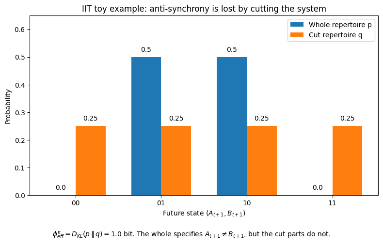

講義ノートでは、Integrated Information Theory（IIT）は、意識に関係する情報を「システム全体として統合されて生み出される情報」として考えると説明されています。integration の部分では、システムを独立した部分に切り分けると、全体として指定されていた関係が失われることがあります。

この例では、講義ノートとは異なる関係を使います。

現在の状態は次のようにします。

```text
m = (A_t, B_t)

## Plot
実行結果は以下の画像です

