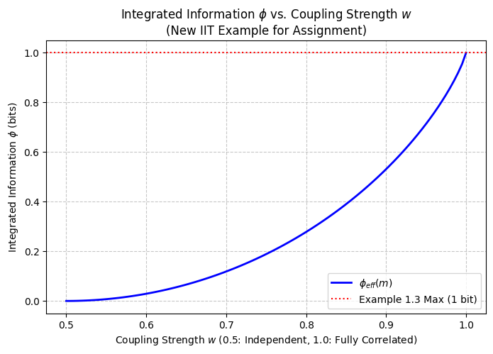

# IIT分析：結合強度の違いが統合情報量 $\phi$ に与える影響

本プロジェクトは、*応用数学と計算B（第3回）* のレポート課題を満たすために作成されました。
講義ノートには明示的に示されていない新しいシナリオとして、**「2つのユニット間の結合強度（相関の強さ）を連続的に変化させたときに、統合情報量 $\phi$ がどのように変化するか」** をシミュレーションし、可視化します。

## コンセプトと数理的設定

現在の状態が $m = (1, 1)$ である2ユニットのシステム $X_t = (A_t, B_t)$ を考えます。ここで、次のタイムステップで2つのユニットが同じ値に同期する確率を決定する「結合パラメータ $w \in [0.5, 1.0]$」を導入します。

$$
p_{eff}(A_{t+1}, B_{t+1} \mid m) = \begin{cases} 
\frac{w}{2}, & (A_{t+1}, B_{t+1}) = (0,0) \text{ または } (1,1) \\ 
\frac{1-w}{2}, & (A_{t+1}, B_{t+1}) = (0,1) \text{ または } (1,0) 
\end{cases}
$$

- $w = 0.5$ のとき、2つの未来のユニットは完全に独立しています（すべての状態の確率が $0.25$）。
- $w = 1.0$ のとき、システムは完全に同期（相関）し、講義ノートの **例1.3** と全く同じ決定論的モデルになります。

システムを $\pi = \{\{A\}, \{B\}\}$ に分割（カット）した場合、各ユニットの周辺確率は常に $0.5$ のままであるため、分割後の有効レパートリー $q_{eff}^{\pi}$ は常にすべての状態で $0.25$（一様分布）になります。

このとき、統合情報量は以下のようにKLダイバージェンスとして計算されます。
$$\phi_{eff}^{\pi}(m) = D_{KL}(p_{eff} \parallel q_{eff}^{\pi})$$

## シミュレーション結果

Pythonスクリプトを実行すると、結合強度 $w$ の上昇に伴って、統合情報量 $\phi$ が 0 ビット（完全な独立・ノイズ）から 1 ビット（完全な統合）まで非線形に上昇していく様子を示す以下のグラフが生成されます。

## Plot

実行結果は以下の画像です。

