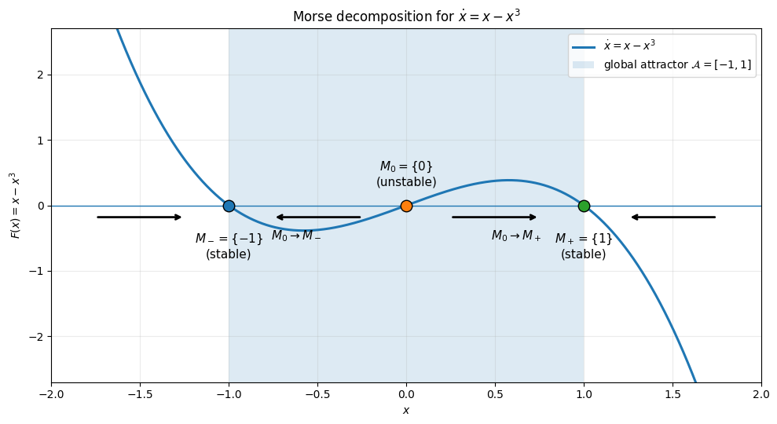

# モース分解

このプログラムは、次の1次元力学系の図を生成する。

$$
\dot{x}=x-x^3
$$

平衡点は $x=-1,0,1$ である。$x=-1$ と $x=1$ は安定であり、$x=0$ は不安定である。

この力学系のモース分解は、

$$
M_-=\{-1\},\quad M_0=\{0\},\quad M_+=\{1\}
$$

である。

モース集合間の有向接続は、

$$
M_0\rightarrow M_-,\quad M_0\rightarrow M_+
$$

である。

したがって、この図は力学系の不変集合と、それらの間で可能な遷移を表しており、この力学系のモースグラフに対応している。
